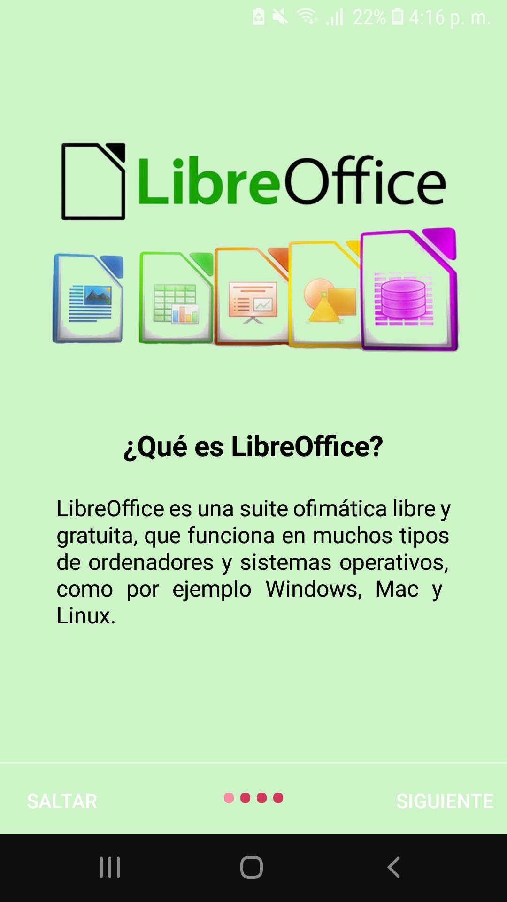
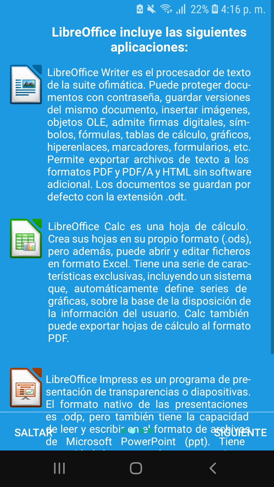
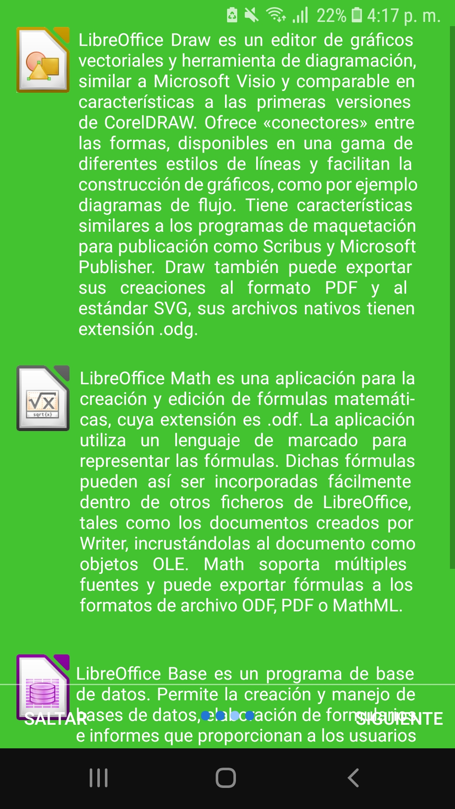
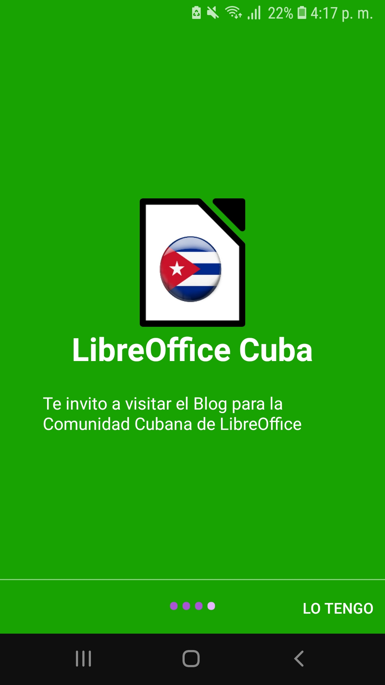
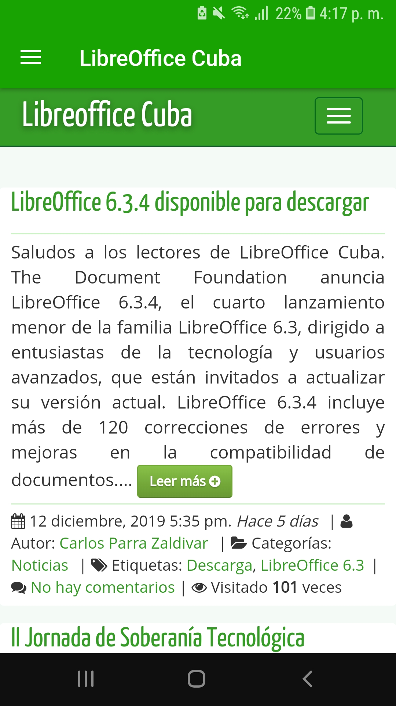
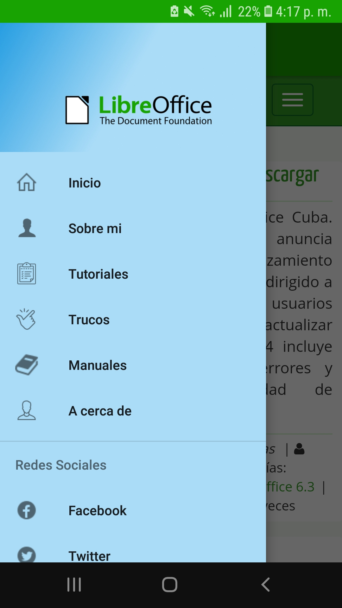
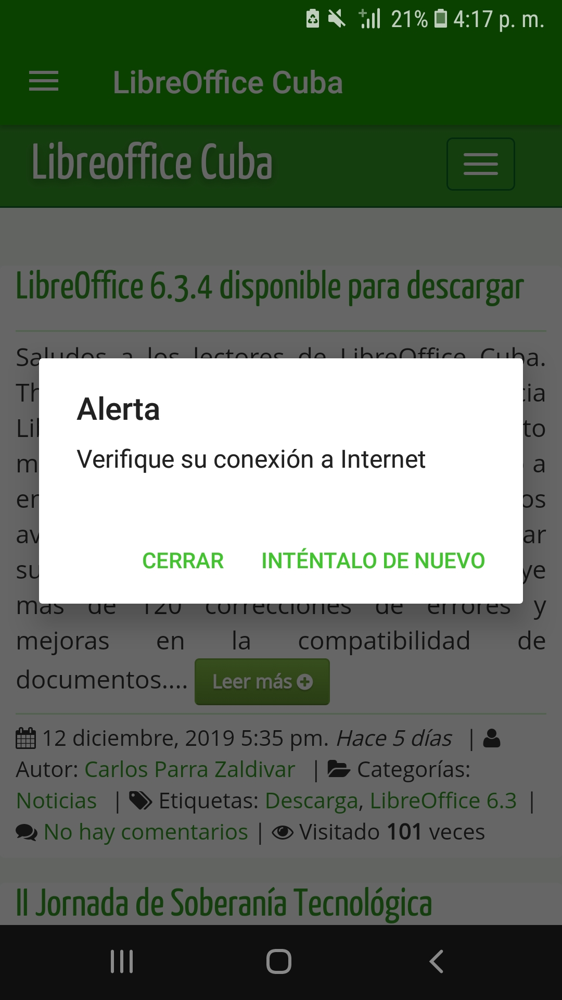

# LibreOffice Cuba | Comunidad cubana de LibreOffice
Comparto el codigo fuente Plantilla nativa de la aplicación Android WebView del Blog Comunidad cubana de LibreOffice.
¡Convierta su aplicación web o sitio web compatible con dispositivos móviles en una aplicación nativa de Android WebView en 2 minutos!

## Instalación
Tener Android Studio + SDK + Gradle

# Screenshots :

        
        
        </img>
		
        </img>
		
        </img>
		
        </img>
		
        </img>
		
        </img>

